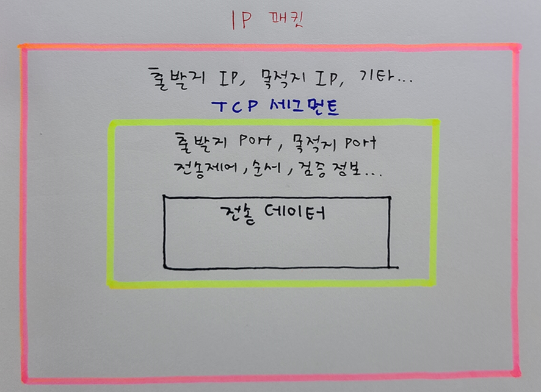

# 인터넷 네트워크


## 인터넷 통신

- 메시지는 수많은 노드들을 거쳐서 전달한다
- 클라이언트 —> 수많은 노드 —> 서버

## IP (Internet Protocol)

### IP 패킷 전달 흐름

1. 응답 IP 주소에 요청메시지 및 전송데이터를 담담은 패킷을 전송한다.
2. 수많은 노드들을 거쳐 서버에 도착한다.
3. 요청왔던 IP주소에 응답메시지를 담은 패킷을 전송한다.
4. 수많은 노드들을 거쳐 클라이언트에 도착한다 (요청 올 때 거쳤던 노드들의 경로랑 다를 수 있음)

### IP 프로토콜의 한계점

- 비연결성
    - 패킷을 받을 대상이 없거나 서비스 불능 상태여도 패킷 전송

    ```markdown
    💡 예시를 들어보자!
    미국에 사는 친구한테 3년만에 편지를 전송한다.
    하지만 그 친구는 이사를 했거나, 1년 유럽여행에 떠난 상황이다.
    그래도 편지는 그대로 전송하고 나는 친구가 편지를 잘 받았는지 확인이 불가능하다...
    ```

- 비신뢰성
    - 중간에 패킷이 사라진다면?

    ```markdown
    💡 예시를 들어보자!
    수많은 노드들을 거쳐 출발지점에서 도착지점으로 간다.
    하지만 중간에 어느 한 노드(서버)가 문제가 생겨 데이터가 유실되도
    전송하는 쪽에서는 유실된 사실을 알지 못한다.
    ```

    - 패킷이 순서대로 오지 않는다면?

    ```markdown
    💡 예시를 들어보자!
    
    카톡으로 "안녕 나는 Alex야 밥은 먹었니?" 라는 메시지를 전송한다.
    메시지는 보통 일정 사이즈가 넘으면 끊어서 보낸다고 한다
    예시로 "안녕", "나는", "Alex야", "밥은", "먹었니"로 끊어서 보낸다고 가정하자.
    이럴때 수많은 노드들에서 메시지들이 각각 다른 루트를 통해 전송될때
    서버에서 받았을때의 결과는 "Alex야 나는 먹었니 안녕 밥은" 로 오는 경우가 생길 수 있다.
    
    이런 경우를 방지하기 위해 사용하는 방법이 TCP 프로토콜이다!
    ```


## TCP, UDP

### TCP

- 전송 제어 프로토콜
- IP 프로토콜의 한계를 보완하고자 사용한다.
- 신뢰할 수 있는 프로토콜이므로 현재는 대부분 TCP를 사용한다.

### 인터넷 프로토콜 계층

| 애플리케이션 계층 | HTTP, FTP |
| --- | --- |
| 전송 계층 | TCP, UDP |
| 인터넷 계층 | IP |
| 네트워크 인터페이스 계층 | LAN 드라이버, 장비 |

```markdown
💡 예시를 들어보자!
채팅 프로그램에서 안녕 ALEX~ 밥은 먹었지? 라는 메시지를 보내려고 하는 상황이다

1. 프로그램이 "안녕 ALEX~ 밥은 먹었지?" 메시지를 생성한다
2. SOCKET 라이브러리를 통해 전송 계층으로 전달한다
3. TCP 정보를 씌운다 (TCP 정보 생성, 메시지 데이터 포함)
4. IP 정보를 씌운다 (IP 패킷 생성, TCP 데이터 포함)
5. LAN 카드를 통해 이더넷 프레임이 포함돼서 나간다
```


### TCP/IP 패킷 구성 정보


### TCP 특징

- 연결지향 - TCP 3 way handshake (물리적인 연결이 아닌 가상  연결)
    - 연결을 한 다음에 메시지를 보낸다
- 데이터 전달 보증
    - 메시지를 전송했을 때 데이터가 누락될 경우 바로 알 수 있다.
- 순서 보장
    - TCP 패킷 내 전송제어, 순서, 검증정보 등을 활용하여 메시지 순서를 보장한다.

### TCP 3 way handshake

- SYN : 접속 요청
- ACK : 요청 수락

클라이언트 ↔ 서버 연결과정

1. 클라이언트 → 서버 : SYN 요청
2. 서버 → 클라이언트 : ACK 수락 + SYN 요청
3. 클라이언트 → 서버 : ACK 수락 + (데이터 전송)

### UDP

- IP + PORT + 체크섬 정도라고 생각하면 된다.
- TCP가 가지고 있는 기능이 없다 (3 way hand shake, 데이터 전달 보증, 순서 보장 x)
- 애플리케이션 추가 작업 필요

#### 왜 UDP를 사용하는가?
```markdown
연결지향(3 way handshake)의 과정에서 시간이 오래걸리고,
데이터 전달 보증 및 순서 보장을 위한 데이터 정보들이 사이즈를 어느정도 차지한다.
하지만 이미 거의 대부분의 곳에서  TCP를 사용하기 때문에 따로 최적화를 하기가 불가능하다.
이 때 UDP를 활용하여 입맛에 맞게 최적화를 진행하며 사용한다.
```


## PORT

- 하나의 IP 내에서 동시에 여러개를 연결해야 할 때 사용
- TCP/IP 패킷에 IP와 함께 PORT 정보도 저장되어있다.
- 0 ~ 65535 할당 가능
- 0 ~ 1023 : 잘 알려진 포트로 사용하지 않는 것이 좋음

유명한 포트 예시

  | 사용처    | port |
  |----| --- |
  | FTP    | 20, 21 |
  | TELNET | 23 |
  | HTTP   | 80 |
  | HTTPS  | 443 |

```markdown
💡 예시를 들어보자!

나는 지금 하나의 컴퓨터로 여러가지의 작업을 동시에 한다.
1. 노래를 듣는다
2. 카톡으로 사진 및 영상을 전송중이다
3. 인강을 듣는다
4. 웹 메모장에 필기를 한다

이처럼 같은 IP(컴퓨터) 하나로 여러개의 애플리케이션을 동시에 구동할 때
이 들을 연결할때 구분하는 방법이 필요하다.
이때 사용하는 것이 port 이다!

📢 비유로 들자면 IP가 아파트면 Port는 몇동 몇호라고 생각하면 된다!!
```


## DNS

- 도메인 네임 시스템
- 전화번호부 같은 역할을 한다.
- DNS 서버에서 도메인을 구매해야한다.

### DNS를 왜 사용하는가?

- IP는 기억하기가 어렵다
- IP는 변경될 수 있다

### DNS 사용 흐름

1. DNS 서버에서 도메인명인 www.example.com의 IP를 받아온다.
2. DNS 서버에서 받아온 IP로 서버에 접속한다.